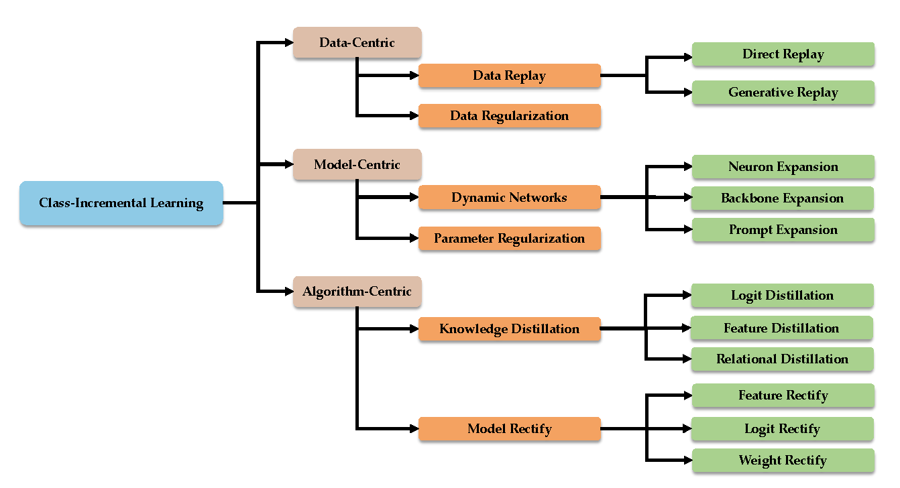
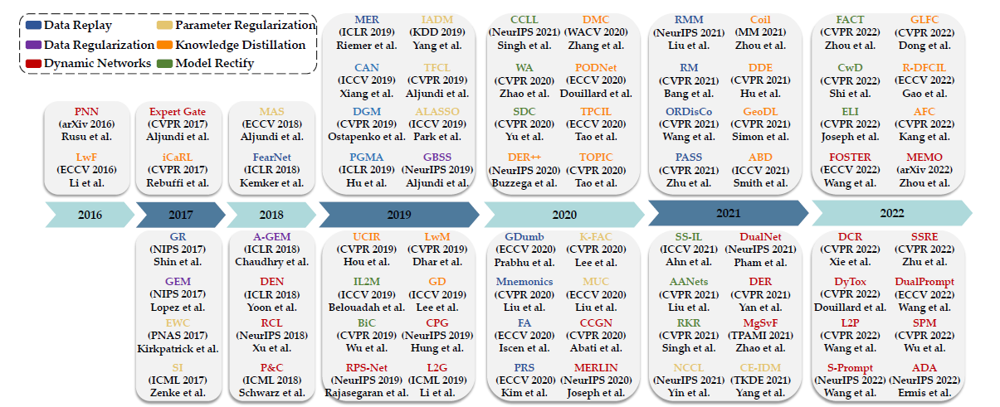
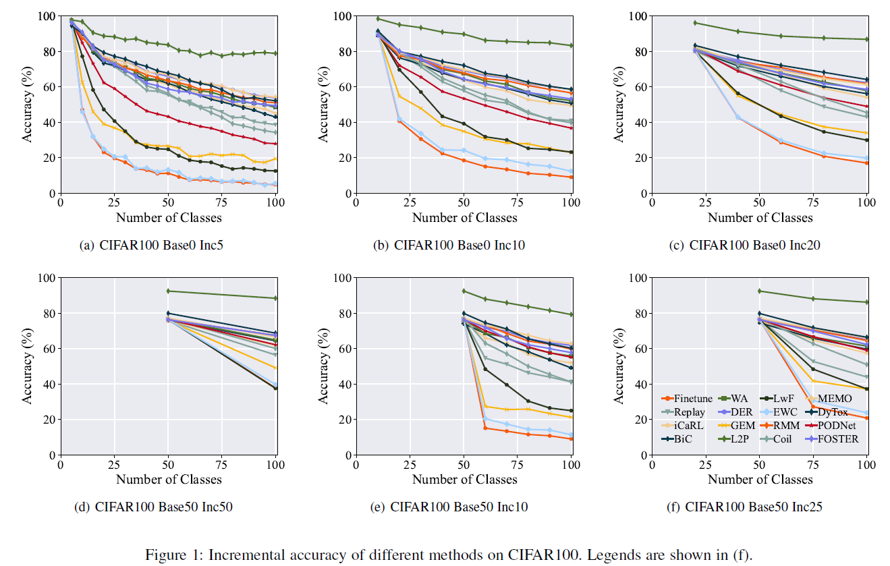
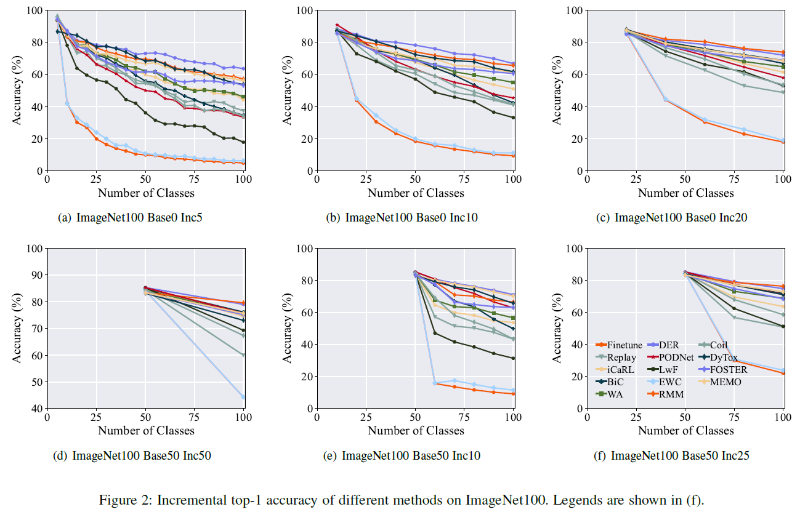
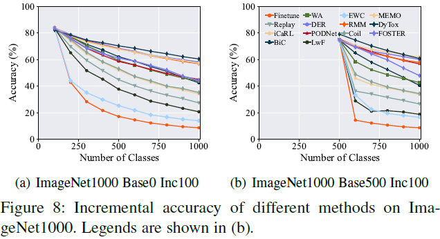
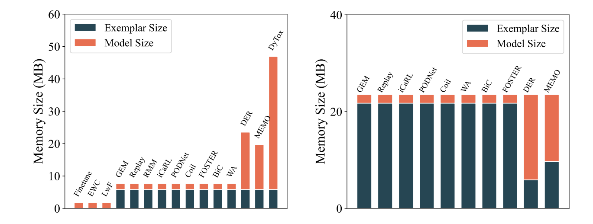
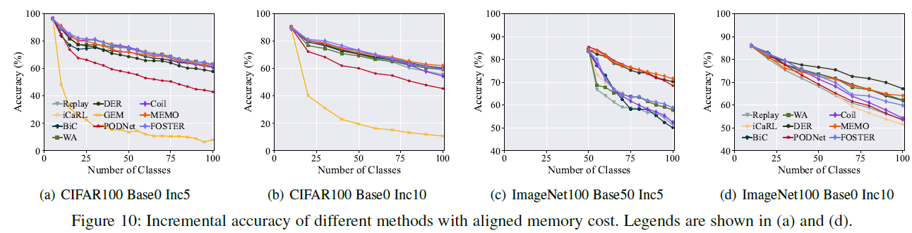
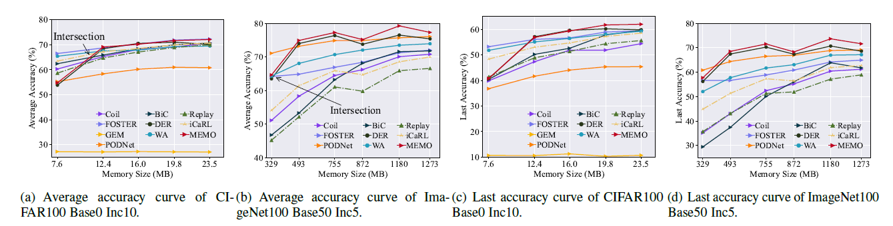
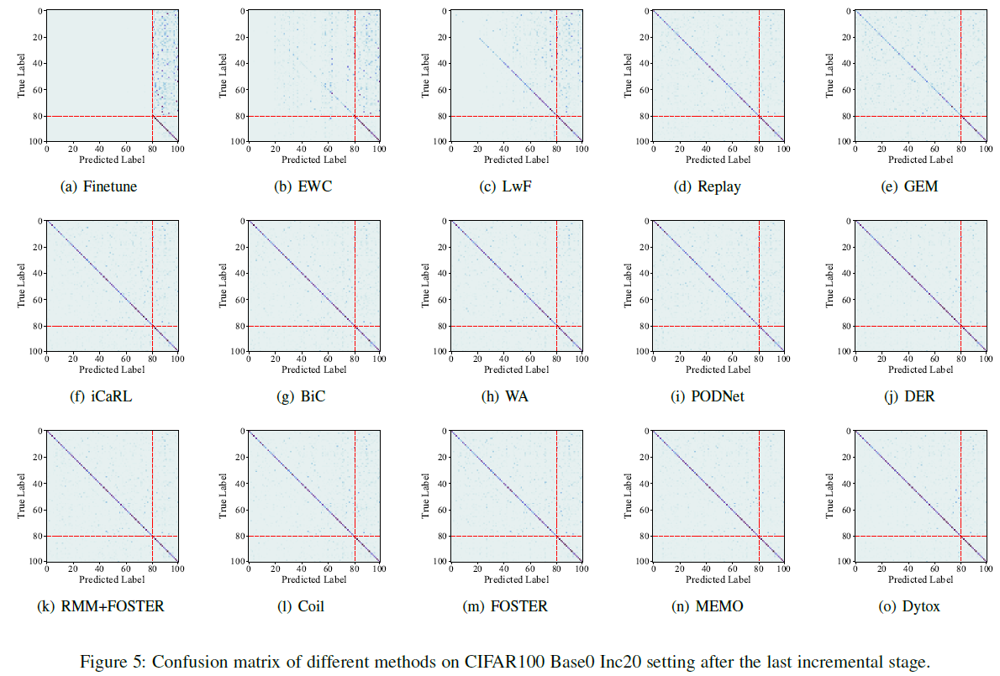
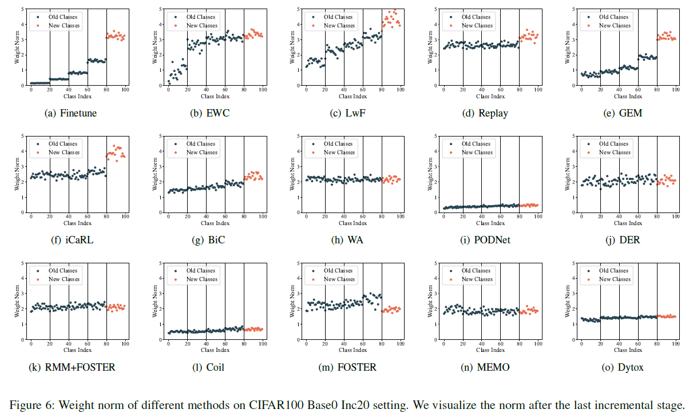

# Deep Class-Incremental Learning: A Survey

The code repository for "[Deep Class-Incremental Learning: A Survey](http://arxiv.org/abs/2302.03648)" in PyTorch. If you use any content of this repo for your work, please cite the following bib entry: 

    @article{zhou2023class,
        author = {Zhou, Da-Wei and Wang, Qi-Wei and Qi, Zhi-Hong and Ye, Han-Jia and Zhan, De-Chuan and Liu, Ziwei},
        title = {Deep Class-Incremental Learning: A Survey},
        journal = {arXiv preprint arXiv:2302.03648},
        year = {2023}
     }

Feel free to [create new issues](https://github.com/zhoudw-zdw/CIL_Survey/issues/new) or [drop me an email](mailto:zhoudw@lamda.nju.edu.cn) if you find any interesting paper missing in our survey, and we shall include them in the next version.

## Updates

[02/2023] [arXiv](https://arxiv.org/abs/2302.03648) paper has been released.

[02/2023] The code has been released.

## Introduction

Deep models, e.g., CNNs and Vision Transformers, have achieved impressive achievements in many vision tasks in the closed world. However, novel classes emerge from time to time in our ever-changing world, requiring a learning system to acquire new knowledge continually. For example, a robot needs to understand new instructions, and an opinion monitoring system should analyze emerging topics every day. Class-Incremental Learning (CIL) enables the learner to incorporate the knowledge of new classes incrementally and build a universal classifier among all seen classes. Correspondingly, when directly training the model with new class instances, a fatal problem occurs --- the model tends to catastrophically forget the characteristics of former ones, and its performance drastically degrades. There have been numerous efforts to tackle catastrophic forgetting in the machine learning community. 
In this paper, we survey comprehensively recent advances in deep class-incremental learning and summarize these methods from three aspects, i.e., data-centric, model-centric, and algorithm-centric. We also provide a rigorous and unified evaluation of 16 methods in benchmark image classification tasks to find out the characteristics of different algorithms empirically. Furthermore, we notice that the current comparison protocol ignores the influence of memory budget in model storage, which may result in unfair comparison and biased results. Hence, we advocate fair comparison by aligning the memory budget in evaluation, as well as several memory-agnostic performance measures. 

<div align="center">
  


</div>

## Requirements

### Environment

Here are the requirements for running the code:

1. [torch 1.81](https://github.com/pytorch/pytorch)
2. [torchvision 0.6.0](https://github.com/pytorch/vision)
3. [tqdm](https://github.com/tqdm/tqdm)
4. [numpy](https://github.com/numpy/numpy)
5. [scipy](https://github.com/scipy/scipy)
6. [quadprog](https://github.com/quadprog/quadprog)
7. [POT](https://github.com/PythonOT/POT)

### Dataset

We use [CIFAR100](https://www.cs.toronto.edu/~kriz/cifar.html) and [ImageNet100/1000](https://www.image-net.org/) for our experiments. CIFAR100 will be automatically downloaded when running the code. 

[Here](https://drive.google.com/drive/folders/1RBrPGrZzd1bHU5YG8PjdfwpHANZR_lhJ?usp=sharing) is the file list of ImageNet100.

### Pre-Trained Models

As discussed in the main paper, we aim for a fair comparison among different methods and align the performance at the first stage. Please refer to the instructions to download the pre-trained models in the following section.

## Code Structures

- `checkpoints`: We supply the *same pre-trained checkpoints for most methods* for a fair comparison. Please download the checkpoint from [Google Drive](https://drive.google.com/drive/folders/1FLgnMkNuQyRLjYJ5Khnj370LtfYExZhm?usp=sharing) or [Onedrive](https://entuedu-my.sharepoint.com/:f:/g/personal/n2207876b_e_ntu_edu_sg/EhXYBtaQRbtKhFRaCJ6IgfEBykAUKDDynkfXMULBqYMnKA?e=rjz1sd) and put these checkpoints in this folder.
- `convs`: The network structures adopted in the implementation.
- `exps`: The **default** config files for compared methods. It should be noted that these config files will be overwritten by the parameters (e.g., function `setup_parser` in `main.py`) passed via the command line.
- `scripts`: The scripts for running the code in our evaluations.
- `models`: The implementation of different CIL methods.
- `utils`: Useful functions for dataloader and incremental actions.

## Supported Methods

- `FineTune`: Baseline method which simply updates parameters on new tasks and suffers from catastrophic forgetting. 
- `EWC`: Overcoming catastrophic forgetting in neural networks. PNAS2017 [[paper](https://arxiv.org/abs/1612.00796)]
- `LwF`:  Learning without Forgetting. ECCV2016 [[paper](https://arxiv.org/abs/1606.09282)]
- `Replay`: Baseline method with exemplars.
- `GEM`: Gradient Episodic Memory for Continual Learning. NIPS2017 [[paper](https://arxiv.org/abs/1706.08840)]
- `iCaRL`: Incremental Classifier and Representation Learning. CVPR2017 [[paper](https://arxiv.org/abs/1611.07725)]
- `BiC`: Large Scale Incremental Learning. CVPR2019 [[paper](https://arxiv.org/abs/1905.13260)]
- `WA`: Maintaining Discrimination and Fairness in Class Incremental Learning. CVPR2020 [[paper](https://arxiv.org/abs/1911.07053)]
- `PODNet`: PODNet: Pooled Outputs Distillation for Small-Tasks Incremental Learning. ECCV2020 [[paper](https://arxiv.org/abs/2004.13513)]
- `DER`: DER: Dynamically Expandable Representation for Class Incremental Learning. CVPR2021 [[paper](https://arxiv.org/abs/2103.16788)]
- `RMM`: RMM: Reinforced Memory Management for Class-Incremental Learning. NeurIPS2021 [[paper](https://proceedings.neurips.cc/paper/2021/hash/1cbcaa5abbb6b70f378a3a03d0c26386-Abstract.html)]
- `Coil`: Co-Transport for Class-Incremental Learning. ACM MM2021 [[paper](https://arxiv.org/abs/2107.12654)]
- `FOSTER`: Feature Boosting and Compression for Class-incremental Learning. ECCV 2022 [[paper](https://arxiv.org/abs/2204.04662)]
- `MEMO`: A Model or 603 Exemplars: Towards Memory-Efficient Class-Incremental Learning. ICLR 2023 [[paper](https://arxiv.org/abs/2205.13218)]

# Towards a Fair Comparison of Class-Incremental Learning

In the main paper, we conduct three types of empirical evaluations to find out the characteristics of different methods. They are listed as:

- **Benchmark comparison**: compares the performance of different methods with the same number of exemplars, e.g., 2000 for CIFAR100.

<div align="center">






</div>

- **Memory-aligned comparison**: compares the performance of different methods with the same memory budget to DER. For those methods that consume less budget than DER, we align the cost by saving extra exemplars. For example, a ResNet32 model costs 463,504 parameters (float), while a CIFAR image requires 3 × 32 × 32 integer numbers (int). Hence, the budget for saving a backbone is equal to saving 463,504 floats ×4 bytes/float ÷(3 × 32 × 32) bytes/image ≈ 603 exemplars for CIFAR. Specifically, the memory cost of different methods in traditional benchmark protocol is shown in the left figure, while memory-aligned comparison advocates comparison in the right figure.

<div align="center">





</div>

- **Memory-agnostic comparison**: extends the memory-aligned comparison to the memory-agnostic performance measures, e.g., AUC-A and AUC-L. We set several memory budgets and align the cost of each method to them, drawing the performance-memory curve. The memory-agnostic comparison is not based on any assigned budget, which better measures the extendability of class-incremental learning models.



<div align="center">
  <table>
<tr>
    <th rowspan="2" colspan="1"> Method </th>
<th scope="col" colspan="2">CIFAR100 Base0 Inc10</th>
<th scope="col" colspan="2">ImageNet100 Base50 Inc5</th>
    </tr>
    <tr>
        <th scope="col" colspan="1">AUC-A</th>
<th scope="col" colspan="1">AUC-L</th>
<th scope="col" colspan="1">AUC-A</th>
<th scope="col" colspan="1">AUC-L</th>
    </tr>
    <tr>
        <td>GEM</td>
        <td>4.31</td>
        <td>1.70</td>
        <td>-</td>
        <td>-</td>
    </tr>
    <tr>
        <td>Replay</td>
        <td>10.49</td>
        <td>8.02</td>
        <td>553.6</td>
        <td>470.1</td>
    </tr>
    <tr>
        <td>iCaRL</td>
        <td>10.81</td>
        <td>8.64</td>
        <td>607.1</td>
        <td>527.5</td>
    </tr>
    <tr>
        <td>PODNet</td>
        <td>9.42</td>
        <td>6.80</td>
        <td>701.8</td>
        <td>624.9</td>
    </tr>
    <tr>
        <td>Coil</td>
        <td>10.60</td>
        <td>7.82</td>
        <td>601.9</td>
        <td>486.5</td>
    </tr>
    <tr>
        <td>WA</td>
        <td>10.80</td>
        <td>8.92</td>
        <td>666.0</td>
        <td>581.7</td>
    </tr>
    <tr>
        <td>BiC</td>
        <td>10.73</td>
        <td>8.30</td>
        <td>592.7</td>
        <td>474.2</td>
    </tr>
    <tr>
        <td>FOSTER</td>
        <td><b>11.12</b></td>
        <td><b>9.03</b></td>
        <td>638.7</td>
        <td>566.3</td>
    </tr>
    <tr>
        <td>DER</td>
        <td>10.74</td>
        <td>8.95</td>
        <td>699.0</td>
        <td>639.1</td>
    </tr>
    <tr>
        <td>MEMO</td>
        <td>10.85</td>
        <td><b>9.03</b></td>
        <td><b>713.0</b></td>
        <td><b>654.6</b></td>
    </tr>
</table>
</div>

## Visualizations

We provide the visualizations of the confusion matrix and weight norm of classifiers in class-incremental learning. These visualizations are drawn with the logs after running the code.





## Running scripts

There are three types of experiments in our survey, i.e., benchmark, memory-aligned (`fair`), and memory-agnostic (`auc`) in the `scripts` folder). We give all the scripts for running the experiments in this paper. For example, if you are interested in the benchmark comparison, please run the following command:

```bash
bash ./scripts/benchmark/cifar_b0_5_finetune.sh
```

Similarly, you can run the other scripts in the same way. 

## Calculating the number of exemplars

It must be noted that the **memory-aligned** and **memory-agnostic comparison** protocol requires calculating the number of exemplars for each method. Please refer to `compute_exemplar.py` for more details. The following is an example of calculating the number of exemplars for the `fair` and `auc` protocol.

### Fair

```bash
bash run-fair.sh
```

### AUC

```bash
python compute_exemplar.py -p auc
```

## Acknowledgment

This repo is modified from [PyCIL](https://github.com/G-U-N/PyCIL).

## Correspondence

This repo is developed and maintained by [Qi-Wei Wang](https://www.lamda.nju.edu.cn/wangqiwei/) and [Zhi-Hong Qi](https://www.lamda.nju.edu.cn/qizh/). If you have any questions, please feel free to contact us by opening new issues or email:

- Qi-Wei Wang: wangqiwei@lamda.nju.edu.cn

- Zhi-Hong Qi: qizh@lamda.nju.edu.cn


<div align="center">


</div>
